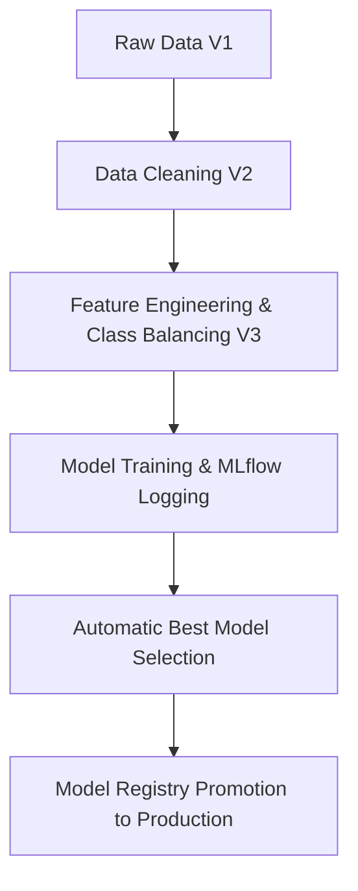

# Titanic Production-Grade MLOps Pipeline

This repository contains a full production-grade MLOps pipeline for the Titanic dataset. It demonstrates data versioning, experiment tracking, pipeline automation, and CI/CD.

## 1. Toolchain Description

- **Git**: Version control for code and configuration.
- **DVC (Data Version Control)**: Tracks dataset versions (V1, V2, V3) and orchestrates the pipeline stages.
- **MLflow**: Tracks experiment metrics, parameters, and manages the **Model Registry**.
- **GitHub Actions**: Automates the CI/CD pipeline, running the full DVC reproduction on every push.
- **Python / Scikit-Learn**: Core machine learning framework for data processing and modeling.

## 2. MLOps Workflow (The Flux)

The pipeline is structured into discrete, reproducible stages managed by DVC:



1.  **Stage: clean_data**: Processes `data/raw/train.csv` (V1). Handles missing values (Age median, Embarked mode) and drops the high-null `Cabin` column.
2.  **Stage: feature_engineering**: Processes cleaned data (V2) into processed data (V3). Extracts `Title` from names, creates `FamilySize`, and applies **Class Balancing** via oversampling to handle survival imbalance.
3.  **Stage: training**: Trains multiple models (Logistic Regression, Random Forest). Logs metrics (Accuracy, Precision, Recall, F1) and model artifacts to a local MLflow server.
4.  **Stage: registration**: Fetches all runs from MLflow, identifies the run with the highest **F1-score**, registers it, and promotes it to the **"Production"** stage in the Model Registry.

## 3. Dataset Versions

- **V1**: Original Kaggle dataset.
- **V2**: Cleaned dataset (handled nulls, basic encoding).
- **V3**: Enhanced dataset (engineered features + class balancing).

## 4. Results & Analysis

### Performance Matrix

| Model               | Accuracy | Precision | Recall | F1-Score |
| :------------------ | :------- | :-------- | :----- | :------- |
| Logistic Regression | ~0.82    | ~0.81     | ~0.74  | ~0.77    |
| Random Forest       | ~0.84    | ~0.81     | ~0.80  | ~0.80    |

### Explanation

- **Random Forest** achieved a higher F1-score (~0.80) compared to Logistic Regression. This is likely due to its ability to capture non-linear relationships between engineered features like `Title` and `FamilySize`.
- **Class Balancing** improved the recall for the minority class (Survived=1), making the model more robust in real-world scenarios.

## 5. Automation & CI/CD

### DVC Pipeline

Run the entire pipeline with a single command:

```bash
dvc repro
```

### GitHub Actions

The `.github/workflows/mlops.yml` file ensures that every code change is validated. It:

1.  Installs dependencies from `requirements.txt`.
2.  Initializes a temporary DVC environment.
3.  Runs `dvc repro` to verify that the code, data, and models are in sync.

## 6. How to Run Locally

1.  Clone the repository.
2.  Install dependencies: `pip install -r requirements.txt`.
3.  Run the pipeline: `dvc repro`.
4.  View results in MLflow: `mlflow ui`.
