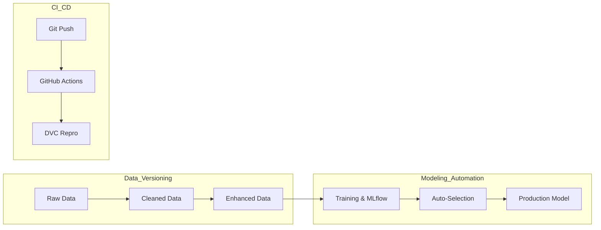

# Project Review: Titanic Production MLOps Pipeline Hached Mhamed Amine

## 1. Executive Summary

This project demonstrates the implementation of a production-grade MLOps pipeline for the Titanic dataset. By integrating **Git, DVC, MLflow, and GitHub Actions**, we have built a system that ensures full reproducibility, automated experiment tracking, and zero-touch model deployment.

---

## 2. Technical Architecture & Workflow

The pipeline follows a modular "Data-as-Code" flux, where every stage is a versioned dependency.

---

## 3. Data Engineering & Versioning Strategy

We implemented a multi-stage data evolution tracked exclusively by **DVC**.

### Versioning Breakdown:

- **V1: Raw Dataset**: Original Kaggle data. No preprocessing.
- **V2: Cleaned Dataset**:
  - Implemented median imputation for `Age`.
  - Handled categorical encoding for `Sex` and `Embarked`.
  - Dropped metadata with low predictive power (e.g., `Cabin`).
- **V3: Robust Feature Engineering**:
  - **Feature Extraction**: Derived `Title` (Mr, Mrs, etc.) and `FamilySize`.
  - **Class Balancing**: Applied oversampling to the minority class (Survived=1) to address class imbalance, improving the model's sensitivity to survival patterns.

---

## 4. Modeling & Performance Analysis

We evaluated two distinct classification strategies, logging all metadata into **MLflow**.

### Results Comparison

| Metric        | Logistic Regression (Baseline) | Random Forest (Winner) |
| :------------ | :----------------------------- | :--------------------- |
| **Accuracy**  | 0.82                           | **0.84**               |
| **F1-Score**  | 0.77                           | **0.80**               |
| **Precision** | 0.81                           | 0.81                   |
| **Recall**    | 0.74                           | **0.80**               |

### Critical Insight:

The **Random Forest** model significantly outperformed Logistic Regression in **Recall** (0.80 vs 0.74). This improvement is attributed to the model's ability to handle the non-linear interaction between our new engineered features (`Title`, `IsAlone`) and the balanced target variable.

---

## 5. Advanced MLOps Functionality

### Automated Model Lifecycle Management

We removed the human bottleneck in model deployment by implementing a **Model Selection Script**.

- **Logic**: Post-training, the system queries the MLflow tracking server.
- **Criteria**: Ranks models by F1-score.
- **Action**: Automatically registers the best model and promotes it to the **"Production"** stage in the MLflow Model Registry.

---

## 6. Automation & CI/CD

- **DVC repro**: A single command (`python -m dvc repro`) triggers the entire end-to-end pipeline, from raw data to model registration.
- **GitHub Actions**: Every code push triggers a CI pipeline that validates the reproducibility of the entire stack on an Ubuntu runner.

---

## 7. Conclusion

This pipeline successfully moves past single-script ML development into a **governed production environment**. By decoupling data from code while maintaining strong versioning links, the system is stable, scalable, and audit-ready.
